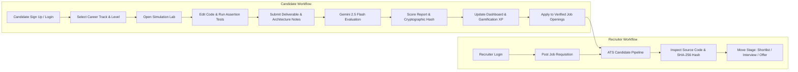
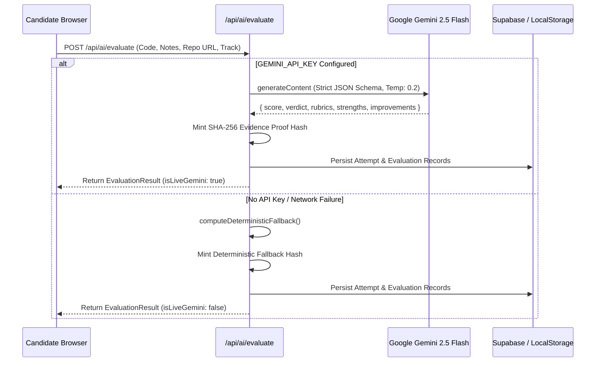
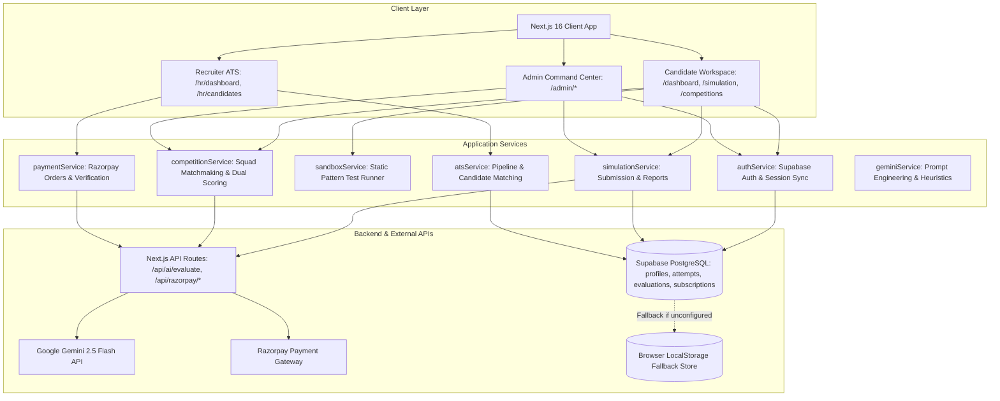

# SkillForge AI

**SkillForge AI** is an evidence-based skill verification and career simulation platform designed to evaluate practical technical competence through realistic, hands-on incident workspaces. Rather than relying on resume keywords or multiple-choice quizzes, candidates solve structured challenges, validate their solutions against automated test harnesses, and submit deliverables for technical evaluation powered by Google Gemini 2.5 Flash. Each verified submission produces a tamper-evident evidence proof hash that feeds directly into a Recruiter ATS pipeline, multi-role squad hackathons, and diagnostic skill gap matrices.

---

## Overview

Traditional hiring suffers from an asymmetry: candidates present self-reported claims on resumes, while recruiters spend significant engineering and sourcing hours administering manual assessments or filtering noisy applicant pools. SkillForge bridges this gap by creating an auditable layer of demonstrated skill data.

### Who It Is For
- **Candidates & Students**: Job seekers across 8 professional tracks (Software Development, Data Analysis, UI/UX Design, AI/ML, Cyber Security, Product Management, Digital Marketing, and Sales) seeking verifiable proof of competence across Fresher, Junior, and Senior tiers.
- **Recruiters & Hiring Managers**: Technical recruiters and engineering leaders seeking structured candidate evaluation, verified GitHub repository deliverables, and semantic candidate-to-job matching.
- **Platform Administrators**: Administrators auditing deliverables, managing user access roles (`CANDIDATE`, `RECRUITER`, `ADMIN`), overseeing hackathon competitions, and tracking recruiter subscriptions.

### The Core Closed-Loop Workflow
SkillForge operates as a closed feedback loop connecting assessment to employment:
```
Select Career Track & Tier
       │
       ▼
Launch Incident Simulation Workspace
       │
       ▼
Iterate Solution & Run Assertion Test Harness
       │
       ▼
Submit Deliverable (GitHub Repo URL + Architecture Notes)
       │
       ▼
AI Technical Evaluation (Google Gemini 2.5 Flash)
       │
       ▼
Generate Cryptographic Evidence Proof Hash (SHA-256)
       │
       ▼
Update Candidate Dashboard, Gamification Profile & Skill Radar
       │
       ▼
Apply to Verified Jobs / Recruiter ATS Sourcing Pipeline
```

---

## The Problem

1. **Resume Inflation & Keyword Optimization**: Resumes highlight self-reported buzzwords and generic course certificates rather than real problem-solving capabilities under production constraints.
2. **Artificial Assessment Formats**: Generic multiple-choice tests (MCQs) assess memorization of syntax and trivia, failing to measure how an engineer triages a production incident, handles backpressure, or addresses concurrency race conditions.
3. **High Recruiter Screening Overhead**: Technical sourcers manually review hundreds of applicants with no standardized proof of ability, leading to screening fatigue and biased heuristic filtering.
4. **Opaque Rejections for Job Seekers**: Candidates receive binary rejections with zero actionable feedback regarding specific architectural, security, or testing gaps.

---

## The Solution

- **Scenario-Driven Incident Workspaces**: Candidates receive authentic scenarios modeled after production bugs (e.g., resolving unbuffered file uploads causing Node.js heap exhaustion, patching SQL injection flaws, or mitigating flash-sale race conditions).
- **Dual AI & Rule-Based Evaluation**: Fast client-side assertion testing provides immediate validation, while the Google Gemini 2.5 Flash API performs deep structural grading across Architecture, Code Quality, Security, and Performance rubrics.
- **Auditable Evidence Proof Hashes**: Every graded submission mints a unique SHA-256 evidence hash encoding track code, seniority tier, score, and submission timestamp.
- **Evidence-Based ATS & Job Board**: Candidates apply directly to job requisitions whose minimum score thresholds they meet, providing recruiters with instant access to submitted source code, test reports, and AI feedback.
- **Multi-Disciplinary Squad Hackathons**: A collaborative 4-role hackathon engine (Frontend, Backend, UI/UX, DevOps) featuring automated matchmaking, team invite codes, and dual team-plus-individual AI scoring.

---

## Core Features

The following table reflects the actual implementation status in the repository:

| Feature | Status | Description |
| :--- | :--- | :--- |
| **Authentication & RBAC** | **Implemented** | Supabase Auth (email/password) with email verification via PKCE callback (`/auth/callback`), session synchronization, and role-based route guards (`CANDIDATE`, `RECRUITER`, `ADMIN`). |
| **Candidate Dashboard** | **Implemented** | Dynamic readiness score ring, core competency dimension bars, verified skill matrix, milestone recommendations, and deliverable history. |
| **Career Tracks (8 Tracks)** | **Implemented** | 8 distinct disciplines with tailored scenario briefs, deliverables scope, and materials previews across Fresher, Junior, and Senior levels. |
| **Interactive Simulation Lab** | **Implemented** | Incident workspace displaying mission briefs, scenario error logs, starter files, syntax-highlighted code editor, and submission modals. |
| **Simulation Test Runner** | **Implemented** | Client-side test harness executing static pattern checks, syntax inspection, and contract assertions (not an isolated containerized Docker runtime). |
| **AI Evaluation Engine** | **Configurable / Implemented** | Next.js API route (`/api/ai/evaluate`) invoking Google Gemini 2.5 Flash (`gemini-2.5-flash`) for multi-dimensional rubrics, strengths, and improvements. Includes deterministic fallback. |
| **AI Mentor Diagnostics** | **Configurable / Implemented** | In-simulation diagnostic hint generator powered by Gemini 2.5 Flash (`type: "mentor_hint"`) providing tactical guidance without revealing full solutions. |
| **Verified Deliverables & Proof Hashes** | **Implemented** | Records candidate repository URLs, live demo links, architecture notes, and generates SHA-256 evidence hashes (`0xSF_GEMINI_[TRACK]_[SCORE]_[TIMESTAMP]`). |
| **Score Reports & Certificates** | **Implemented** | Accessible via `/score-report/[id]`; renders detailed rubric breakdowns, AI evaluator verdicts, test counts, and verified badge links. |
| **Skill Gap Diagnostics** | **Implemented** | Visual diagnostic radar at `/skill-gap` highlighting critical missing skills, weak competencies, and direct links to relevant simulations. |
| **Recruiter ATS Pipeline** | **Implemented** | Recruiter candidate pipeline at `/hr/candidates/[jobId]` with stage management (`Reviewing`, `Shortlisted`, `Interview`, `Pool`, `Rejected`) and candidate evidence inspection drawer. |
| **Semantic Candidate Matching** | **Implemented** | Calculates candidate-to-job match percentages via skill intersection weighting (60%) and simulation score (40%), with natural language fit summaries. |
| **Verified Job Marketplace** | **Implemented** | Job board at `/jobs` filtering by track and salary, comparing candidate scores against minimum thresholds, and supporting one-click applications. |
| **Multi-Role Squad Competitions** | **Implemented** | Hackathon engine at `/competitions` with 4-role balance (Frontend, Backend, UI/UX, DevOps), 1-click solo matchmaking, team invite codes, and dual leaderboards. |
| **Gamification Engine** | **Implemented** | XP accumulation, 8 progression tiers (Novice to Fellow), streak tracking, and unlockable badge medallions viewable at `/badges`. |
| **Admin Command Center** | **Implemented** | Administration console at `/admin` managing user profiles, promoting/demoting user roles, auditing deliverables, and configuring hackathons. |
| **Payment Gateway** | **Configurable / Implemented** | Recruiter subscriptions (Monthly ₹500, Annual ₹5,000) using Razorpay REST API order generation and HMAC-SHA256 signature verification, with simulated test fallbacks. |
| **Notification Center** | **Implemented** | Slide-out notifications drawer in `TopHeader` with real-time event updates, unread badge counters, and mark-as-read controls. |

---

## Product Workflow



---

## Supported Career Tracks

SkillForge includes configuration and simulation briefs for 8 industry tracks across 3 difficulty tiers:

| Track Code | Track Name | Supported Levels | Simulation Scenario Example | Submission Artifact | Status |
| :--- | :--- | :--- | :--- | :--- | :--- |
| **`SD`** | Software Developer | Fresher, Junior, Senior | Resolving unbuffered upload memory leaks; flash-sale distributed locking | GitHub Repo URL + Architecture Write-up | **Fully Implemented** |
| **`DA`** | Data Analyst | Fresher, Junior, Senior | E-commerce funnel drop-off analysis; multi-touch attribution modeling | Cleaned CSV / Report Upload + Colab/Tableau Link | **Fully Implemented** |
| **`UX`** | UI / UX Designer | Fresher, Junior, Senior | Mobile registration contrast overhaul; enterprise design system tokens | Figma Prototype URL + Design System Rationale | **Fully Implemented** |
| **`AI`** | AI / ML Engineer | Fresher, Junior, Senior | LoRA fine-tuning for domain LLMs; RAG pipeline chunking optimization | Colab / GitHub Notebook URL + Metrics Summary | **Fully Implemented** |
| **`CS`** | Cyber Security | Fresher, Junior, Senior | OWASP SQL injection remediation; zero-trust supply chain triage | Remediation Patch URL + Incident Triage Notes | **Fully Implemented** |
| **`PM`** | Product Manager | Fresher, Junior, Senior | Push notification feature specs; B2B self-serve billing tiered PRD | PRD Document Link (Notion/Doc) + Executive Notes | **Fully Implemented** |
| **`DM`** | Digital Marketing | Fresher, Junior, Senior | Technical SEO indexing audit; CAC optimization across paid search | Growth Deck Link + Ad Copy Sheet | **Fully Implemented** |
| **`SA`** | Sales | Fresher, Junior, Senior | Enterprise discovery objection handling; 3-year TCO & ROI model | Pitch Deck / Loom Link + Objection Cadence | **Fully Implemented** |

---

## Simulation System Architecture

The simulation environment balances immediate feedback with thorough evaluation:

1. **In-Browser Workspace**: Candidates review scenario briefs, downloadable logs, API specifications, and task requirements. A built-in code editor allows editing relevant source files directly.
2. **Automated Assertion Test Runner**: When the candidate clicks **Run Tests**, `sandboxService.ts` executes static syntax parsing and assertion rules tailored to the selected track and tier. For example:
   - In `SD-Fresher`, it checks for null guards on optional properties and case-insensitive regex flags (`/i`).
   - In `SD-Junior`, it validates stream chunk counters and ensures unbounded `Buffer.concat` calls are absent to prevent heap exhaustion.
   - In `SD-Senior`, it verifies idempotency key tracking and boundary checks preventing negative inventory.
3. **Technical Distinction**: The test harness runs **static pattern and rule-based validation** within the browser. It does **not** spin up an isolated Linux container, Docker daemon, or WebAssembly runtime.
4. **Submission & Persistence**: Submissions trigger a dual workflow: deliverables are saved to Supabase (`simulation_attempts` and `evaluations`) when configured, with automatic fallback to browser `localStorage` (`skillforge_real_deliverables`) when operating in offline/demo mode.

---

## AI Evaluation Engine

SkillForge integrates Google Gemini for technical grading and diagnostic mentoring.



### Key Technical Specifications
- **Model**: Google Gemini 2.5 Flash (`gemini-2.5-flash`) via Google AI Studio API (`v1beta`).
- **Endpoint**: Handled in Next.js App Router at `src/app/api/ai/evaluate/route.ts`.
- **Inputs**: Career track code, challenge title, problem statement, candidate code diffs, GitHub repository URL, architecture write-up, and squad role contributions.
- **Rubrics Graded**:
  - `architecture`: Structural modularity, error boundaries, and design patterns.
  - `codeQuality`: Code readability, idiomatic conventions, and defensive programming.
  - `security`: Sanitization, authentication boundaries, and edge case resilience.
  - `performance`: Time/space complexity, streaming backpressure, and latency considerations.
- **Fallback Heuristic**: When `GEMINI_API_KEY` is not present, `computeDeterministicFallback()` evaluates code length, architecture write-up structure, and repository validity to generate a realistic score (78–98) and rubrics, marking `isLiveGemini: false` in the response payload.

---

## Recruiter ATS & Sourcing Workflow

The recruiter workspace (`/hr/*`) provides tools to review candidate proof without manual resume parsing:

1. **Candidate Pipeline**: Visual stage-tracking board at `/hr/candidates/[jobId]` categorizing applicants into `Reviewing`, `Shortlisted`, `Interview`, `Pool`, and `Rejected`.
2. **Semantic Matching**: Matches applicant skill sets against job requirements using intersection scoring combined with verified simulation scores:
   $$\text{Match Percentage} = (\text{Skill Match Ratio} \times 60\%) + (\text{Candidate Simulation Score} \times 40\%)$$
3. **Candidate Evidence Drawer**: Clicking any candidate opens an inspection panel detailing:
   - Full GitHub repository link and live cloud deployment URL.
   - Four-dimensional AI rubric scores and qualitative feedback summary.
   - Cryptographic SHA-256 proof hash validating submission authenticity.
4. **Requisition Creator**: Recruiters publish custom requisitions at `/hr/jobs/create`, specifying required skill tags and minimum simulation score thresholds.
5. **Subscription Activation**: Integrated with Razorpay at `/admin/subscriptions` and recruiter checkout modals, offering Monthly (₹500) and Annual (₹5,000) access tiers.

---

## Multi-Role Squad Competitions (Hackathons)

SkillForge includes a collaborative hackathon platform (`/competitions`):

- **Balanced Squad Engine**: Requires 4 distinct engineering seats per team:
  1. `Frontend Developer`: High-density grids, streaming telemetry, Next.js.
  2. `Backend Developer`: Distributed locking, idempotency keys, Node.js/Go.
  3. `UI / UX Designer`: High-density dashboard prototypes, design tokens, Figma.
  4. `Database & DevOps Engineer`: Connection pooling, Redis caching, Docker Compose.
- **Solo Matchmaking**: Candidates registering solo select their role and seniority tier (`fresher`, `junior`, `senior`). The matchmaking engine pairs them into an active forming squad with open vacancies for their role or creates a new squad.
- **Team Invites**: Teams receive unique invite codes (e.g., `SF-SQ1-XYZ`) to recruit specific peers.
- **Dual AI Evaluation**: When a squad submits their monorepo and architecture notes:
  - **Group Score**: Evaluates overall architectural cohesion, end-to-end user experience, and integration quality.
  - **Individual Role Score**: Isolates individual contributions, ensuring high performers receive verified credentials even if their squad experiences blockers.
- **Dual Leaderboards**: Real-time group standings and individual role rankings with role filtering (`Frontend`, `Backend`, `UI`, `DevOps`).

---

## Technology Stack

| Layer | Technology | Purpose |
| :--- | :--- | :--- |
| **Frontend Framework** | Next.js 16.3.5 (App Router) | Server-side rendering, API route handlers, Turbopack builds |
| **Core Language** | TypeScript 5 | Strict static typing across models, services, and UI components |
| **UI Library** | React 19.2.8 | Declarative component hierarchy and concurrent rendering |
| **Styling & Design System** | Modular Vanilla CSS | Dark/light theme engine, CSS custom properties, responsive grids |
| **Animations & Icons** | Framer Motion & Lucide React | Smooth state transitions, interactive drawers, iconography |
| **Data Visualization** | Recharts 3.10.1 | Skill radar diagnostics and competency dimension charts |
| **Database & Auth** | Supabase (`@supabase/ssr` & `@supabase/supabase-js`) | PostgreSQL relational store and GoTrue session management |
| **AI Grading Engine** | Google Gemini 2.5 Flash API | Technical evaluation, rubric grading, and mentor diagnostics |
| **Payments Gateway** | Razorpay REST API & SDK | Recruiter subscription orders and HMAC-SHA256 signature verification |
| **Client State & Bus** | Reactive CustomEvents & LocalStorage | Decoupled cross-tab reactivity and zero-config offline fallback |

---

## System Architecture



---

## Repository Structure

```
SkillForge/
├── DOC/
│   └── SkillForge_AI_PRD.md                  # Comprehensive Product Requirements Document
├── SKILL/                                    # Skill definitions and architectural blueprints
└── skillforge-app/                           # Next.js Fullstack Web Application
    ├── public/
    │   ├── images/                           # Authentic simulation & track cover assets
    │   │   ├── ai-simulation.jpg
    │   │   ├── data-simulation.jpg
    │   │   ├── hero-edtech.jpg
    │   │   ├── marketing-simulation.jpg
    │   │   ├── pm-simulation.jpg
    │   │   ├── sales-simulation.jpg
    │   │   ├── security-simulation.jpg
    │   │   ├── swe-simulation.jpg
    │   │   ├── ux-simulation.jpg
    │   │   └── verified-badge.jpg
    ├── scripts/
    │   ├── audit_routes.js                   # HTTP route audit testing 22 production endpoints
    │   └── test_candidate_and_competitions.js # End-to-end data integrity validation script
    ├── src/
    │   ├── app/
    │   │   ├── admin/                        # Admin console (users, deliverables, competitions)
    │   │   ├── api/
    │   │   │   ├── ai/evaluate/route.ts      # Live Gemini 2.5 Flash evaluation endpoint
    │   │   │   └── razorpay/                 # Order creation & signature verification routes
    │   │   ├── auth/                         # Login, registration, and PKCE callback pages
    │   │   ├── badges/                       # Gamification medallions showcase
    │   │   ├── careers/                      # 8 Career tracks directory and tier configuration
    │   │   ├── competitions/                 # Multi-role hackathons & squad workspaces
    │   │   ├── dashboard/                    # Dynamic candidate overview dashboard
    │   │   ├── hr/                           # Recruiter ATS, job requisition creator, candidates
    │   │   ├── jobs/                         # Candidate verified jobs marketplace
    │   │   ├── score-report/[id]/            # Evaluation certificates and rubric breakdowns
    │   │   ├── simulation/                   # Interactive incident sandbox & test runner
    │   │   └── skill-gap/                    # Diagnostic skill radar and curriculum recommendations
    │   ├── components/
    │   │   ├── auth/RoleGuard.tsx            # Role-based route guard component
    │   │   ├── gamification/BadgeMedallion.tsx
    │   │   ├── layout/Sidebar.tsx, TopHeader.tsx
    │   │   ├── payment/RazorpayCheckoutModal.tsx
    │   │   └── ui/NotificationDropdown.tsx
    │   ├── lib/
    │   │   └── supabase.ts                   # Supabase browser client and TypeScript schemas
    │   ├── services/
    │   │   ├── atsService.ts                 # Recruiter candidate tracking & stage transitions
    │   │   ├── authService.ts                # Supabase auth wrapper & session synchronization
    │   │   ├── competitionService.ts         # Squad matchmaking, invite codes, dual scoring
    │   │   ├── deliverableService.ts         # Deliverable storage, SHA-256 hashes, status audit
    │   │   ├── gamificationService.ts        # XP calculations, levels, streak maintenance
    │   │   ├── geminiService.ts              # Gemini API client wrapper & semantic matching
    │   │   ├── jobService.ts                 # Job requisition store & threshold filtering
    │   │   ├── notificationService.ts        # Client-side reactive notifications store
    │   │   ├── paymentService.ts             # Subscription plans and Razorpay integration
    │   │   ├── sandboxService.ts             # Simulation starters & static assertion test runner
    │   │   └── simulationService.ts          # Deliverable submission & score report retrieval
    │   └── styles/
    │       └── globals.css                   # Core design tokens, theme engine, utilities
    ├── supabase/
    │   ├── migrations/                       # Database migrations for competitions & subscriptions
    │   └── schema.sql                        # PostgreSQL table schemas and RLS policies
    ├── package.json
    ├── tsconfig.json
    └── next.config.ts
```

---

## Getting Started

Follow these steps to set up and run SkillForge AI on a fresh machine:

### 1. Prerequisites
- **Node.js**: v18.18.0 or later (v20+ recommended).
- **npm** or **yarn**.
- **Git**.

### 2. Clone the Repository
```bash
git clone https://github.com/zeelpatel12ka4-cmd/SkillForge.git
cd SkillForge/skillforge-app
```

### 3. Install Dependencies
```bash
npm install
```

### 4. Configure Environment Variables
Create a `.env.local` file in the `skillforge-app/` directory:
```bash
cp .env.example .env.local
```
Update `.env.local` with your credentials:
```env
# Supabase Configuration
NEXT_PUBLIC_SUPABASE_URL=https://your-project.supabase.co
NEXT_PUBLIC_SUPABASE_ANON_KEY=your-supabase-anon-key

# Razorpay Payment Gateway
NEXT_PUBLIC_RAZORPAY_KEY_ID=rzp_test_your_key_id
RAZORPAY_KEY_SECRET=your_razorpay_secret

# Google Gemini AI Integration
GEMINI_API_KEY=your_google_gemini_api_key
NEXT_PUBLIC_GEMINI_API_KEY=your_google_gemini_api_key
```

> **Note**: SkillForge includes built-in offline/demo fallbacks. If external API keys are omitted, the platform will continue functioning using deterministic evaluators, simulated orders, and local persistence.

### 5. Run Database Migrations (Optional)
If using Supabase, navigate to the Supabase SQL Editor and execute:
1. `supabase/schema.sql` (Creates profiles, simulation attempts, evaluations, and jobs tables).
2. `supabase/migrations/20260912_competitions_and_subscriptions.sql` (Creates competitions, squads, and subscriptions tables).

### 6. Start the Development Server
```bash
npm run dev
```
Open [http://localhost:3000](http://localhost:3000) in your browser.

### 7. Build for Production
To test the production build with Turbopack:
```bash
npm run build
npm start
```

---

## Environment Variables Reference

| Variable | Required | Purpose | Example Placeholder |
| :--- | :--- | :--- | :--- |
| `NEXT_PUBLIC_SUPABASE_URL` | Optional | Supabase project URL for database and GoTrue authentication | `https://xyzcompany.supabase.co` |
| `NEXT_PUBLIC_SUPABASE_ANON_KEY` | Optional | Public anonymous key for client-side Supabase requests | `eyJhbGciOi...` |
| `GEMINI_API_KEY` | Optional | Google AI Studio key for live Gemini 2.5 Flash evaluations | `AIzaSy...` |
| `NEXT_PUBLIC_GEMINI_API_KEY` | Optional | Client-side alias for Gemini API key | `AIzaSy...` |
| `NEXT_PUBLIC_RAZORPAY_KEY_ID` | Optional | Razorpay key ID for recruiter subscription checkouts | `rzp_test_...` |
| `RAZORPAY_KEY_SECRET` | Optional | Razorpay secret for HMAC-SHA256 signature verification | `your_secret_here` |

---

## Security Notes & Implementation Limitations

### Security Best Practices
- **Never commit `.env.local`**: Ensure private keys (`RAZORPAY_KEY_SECRET`, `GEMINI_API_KEY`) remain in environment variables and are never checked into version control.
- **Cryptographic Verification**: Deliverable proof hashes (`verifiedHash`) are minted server-side using SHA-256 signatures combining submission timestamp, score, and candidate identifiers.

### Current Implementation Limitations
1. **Client-Side Sandbox Validation**: The in-browser simulation test runner executes static syntax pattern analysis and rule-based assertions. It is not an isolated containerized execution environment (e.g., Docker or Firecracker microVM). Arbitrary untrusted user code is not executed on server infrastructure.
2. **Client-Side Authorization Guards**: Role-based access control (`RoleGuard.tsx`) restricts page views on the client. Server-side middleware checks should be expanded in production for complete API endpoint protection.
3. **Permissive Database Policies**: In the initial development schema (`schema.sql`), Row-Level Security (RLS) policies permit public reads and inserts to accommodate rapid testing. Stricter tenant-scoped policies should be applied prior to enterprise deployment.
4. **LocalStorage Fallback Store**: When Supabase is not connected, user sessions, deliverables, and competition squads are saved in browser `localStorage`. This data is scoped to the local browser and will not sync across different devices without a live database.

---

## Demo and Fallback Behaviour

SkillForge includes comprehensive fallback layers to guarantee demo resilience:

- **Zero-Config Offline Mode**: If `NEXT_PUBLIC_SUPABASE_URL` is not provided, authentication functions in a local mode, saving user profiles and attempts directly to browser storage.
- **Deterministic AI Fallback**: If `GEMINI_API_KEY` is not provided or Google's API experiences rate limits, `/api/ai/evaluate` switches to `computeDeterministicFallback()`. It analyzes code length, architecture write-up structure, and GitHub repository validity to generate a realistic score (78–98), rubrics, and feedback, returning `isLiveGemini: false`.
- **Simulated Payment Verification**: If Razorpay API keys are absent, `/api/razorpay/create-order` generates a local mock order (`order_mock_[TIMESTAMP]`), and `/api/razorpay/verify-payment` verifies the test order without charging real currency.
- **Cross-Component Reactivity**: Changes in user XP, newly recorded deliverables, and squad registrations dispatch browser `CustomEvent` signals (`skillforge_xp_updated`, `skillforge_deliverable_created`, `skillforge_competitions_updated`), ensuring the UI updates instantaneously across tabs.

---

## Known Limitations

1. **Static Validation vs. Full Runtime Execution**: The code sandbox validates code structure and logic patterns rather than running full compiler toolchains (e.g., executing `npm test` inside an isolated container).
2. **Heuristic Keyword Matching**: Candidate-to-job matching computes keyword intersections and score weightings rather than utilizing dense vector embeddings (e.g., pgvector / Pinecone).
3. **Artifact Submissions as URLs**: Simulation deliverables currently accept external URLs (GitHub repositories, live Vercel deployments, Figma prototypes, Colab notebooks) rather than hosting multipart direct zip file uploads on S3/R2 storage.
4. **Local Competition Roster Scope**: Solo matchmaking pairs candidates into squads dynamically within the shared database or local storage instance; multi-region distributed matchmaking queues are not yet implemented.

---

## Roadmap

- [ ] **Isolated Containerized Execution**: Integrate WebAssembly runtimes or containerized sandboxes (e.g., Docker / Firecracker) to run real compilation and automated test suites for submitted code.
- [ ] **Dense Vector Semantic Search**: Implement `pgvector` embeddings in Supabase to calculate semantic similarity between candidate codebases and job descriptions.
- [ ] **GitHub Webhook Integration**: Automatically ingest pull requests and commit telemetry directly from candidates' connected GitHub repositories.
- [ ] **Enterprise SSO & SAML**: Add enterprise single sign-on (Okta, Azure AD) for corporate hiring partners and universities.
- [ ] **Automated Plagiarism & Anti-Cheat Telemetry**: Introduce keystroke dynamics, paste velocity tracking, and LLM-signature detection on submitted code.

---

## Why SkillForge?

- **Verifiable Proof of Work**: Replaces subjective resume screening with auditable source code, passing test assertions, and AI rubrics.
- **Realistic Problem Contexts**: Candidates tackle production scenarios (memory leak refactoring, idempotency locks, security patches) instead of artificial textbook algorithms.
- **Actionable Growth Diagnostics**: Failed simulations pinpoint exact competency deficiencies across Architecture, Security, and Quality, directing candidates to targeted improvement paths.
- **Equitable Hiring**: Candidates are evaluated on their demonstrated work product, giving self-taught developers and non-traditional candidates equal opportunity to showcase job readiness.

---

## Visual Previews

The repository includes authentic visual assets in `public/images/`:

| Track / Feature | Preview Asset Path | Description |
| :--- | :--- | :--- |
| **Platform Hero** | `public/images/hero-edtech.jpg` | Candidate workspace and skill verification banner |
| **Software Development** | `public/images/swe-simulation.jpg` | Incident workspace for API validation and streaming fixes |
| **Data Analysis** | `public/images/data-simulation.jpg` | Funnel analytics and cohort retention workspace |
| **UI / UX Design** | `public/images/ux-simulation.jpg` | Design system tokens and prototype evaluation |
| **AI / Machine Learning** | `public/images/ai-simulation.jpg` | LLM fine-tuning and RAG retrieval workspace |
| **Cyber Security** | `public/images/security-simulation.jpg` | OWASP vulnerability patching and incident triage |
| **Product Management** | `public/images/pm-simulation.jpg` | Feature specification and PRD roadmapping |
| **Digital Marketing** | `public/images/marketing-simulation.jpg` | Acquisition channels and CAC optimization |
| **Sales Engineering** | `public/images/sales-simulation.jpg` | Enterprise discovery and objection handling |
| **Verified Credential** | `public/images/verified-badge.jpg` | Cryptographic evidence proof badge medallion |

---

## License

This project is licensed under the MIT License — see the [LICENSE](LICENSE) file for details. Built for verifiable, evidence-based technical talent discovery.
